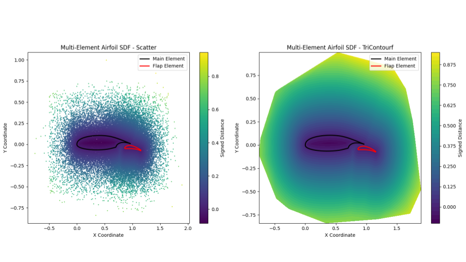
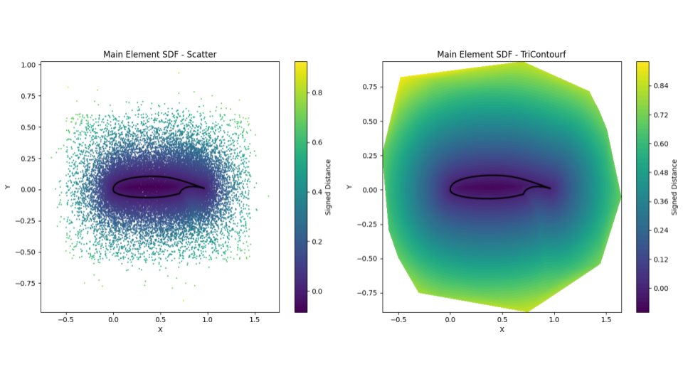

# Siugned Distance Function in 2D 

This repository provides a simple implementation to compute Signed Distance Fields (SDFs) for 2D geometries defined as polygons. It is designed with flexibility in mind so that it can be used for multiple objects defined as polygons. In the example provided, we demonstrate its usage on a multi-element airfoil, where the airfoil is composed of a main element and a flap.

## Overview

The library includes two main classes:

- **Polygon**:  
  This class handles individual 2D polygon geometries. It provides functions to:
  - Compute the SDF for a given set of points relative to the polygon using a vectorized algorithm.
  - Sample points around the polygon by combining uniform sampling from an extended bounding box and perturbations around the polygon vertices.

- **MultiplePolygons**:  
  This class allows you to work with multiple `Polygon` objects simultaneously. It computes a combined SDF (representing the union of the geometries) by taking the minimum SDF value at each point across all provided polygons. It also supports sampling points around the union of all polygons.

